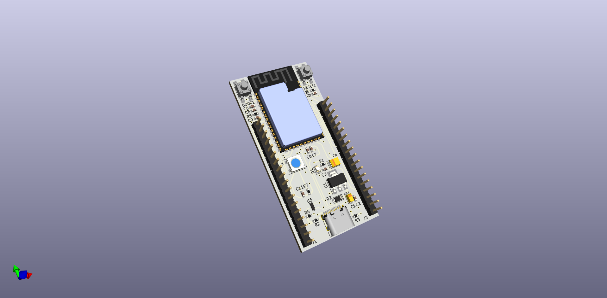
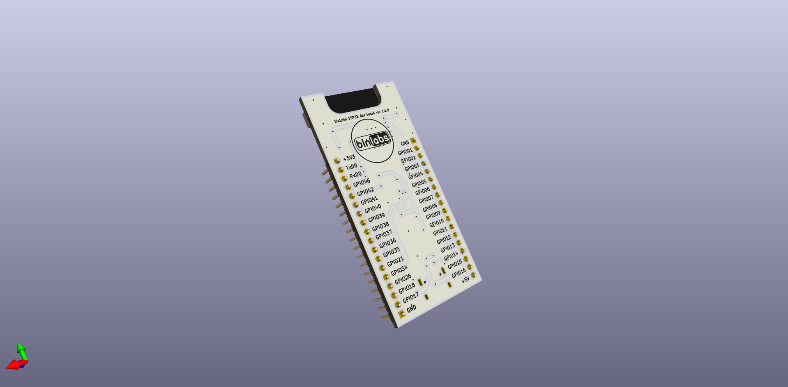

# ESP32-S2-DevelopmentBoard

CUstom DIY Development board based around ESP32-S2, USB typeC, Native USB and fully addressable LED RGB build in. 

Features:

* ESP32-S2
* USB type C
* Fully addressable RGB LED 
* Native USB by default

## Revision 1.1.0

### Major Changes from rev 1.0.0

- BOM file (SMD resistance)
- PIN for RGB LED

### Minor Changes from rev 1.0.0

- PCB cutout for the Antena
- PIN Header for the Power (+3V3, 5V and GND)
- PIN description on the back side 

## Fabrication files 

Get fabrication files from [**Gumroad**](https://blnlabs.gumroad.com/l/ESP32-S2DevelopmentBoard) or clone project and create fabrication files by yourself with instryctions from 

* [**YouTube Video**: KiCad to JLCPCB - Gerber and SMD assembly](https://youtu.be/nr_URKTHS4Y)
* [**Blog Post**: Step-by-step guide: PCB from Schematic to Fabrication and Assembly](https://blnlabs.com/step-by-step-guide-pcb-from-schematic-to-fabrication-and-assembly/)

